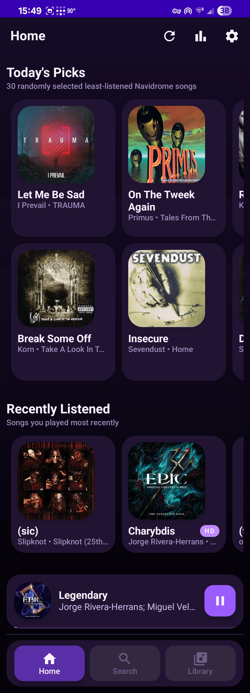
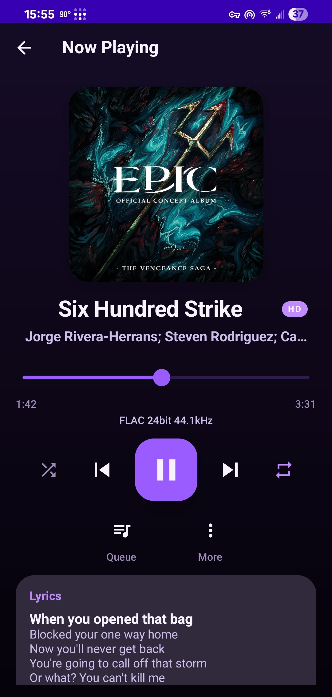
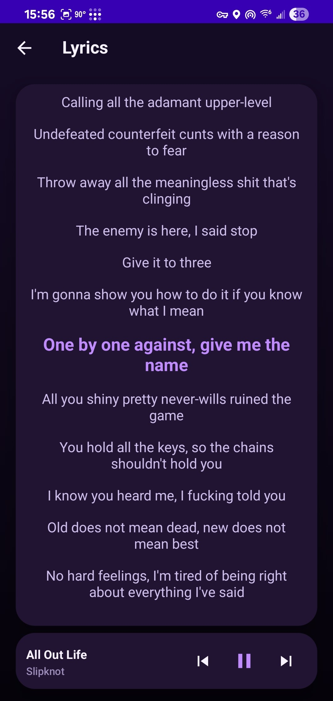
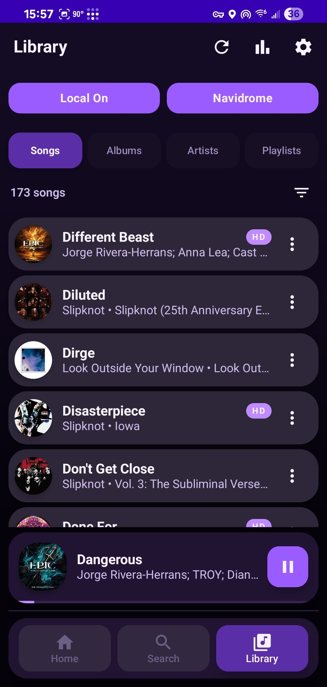
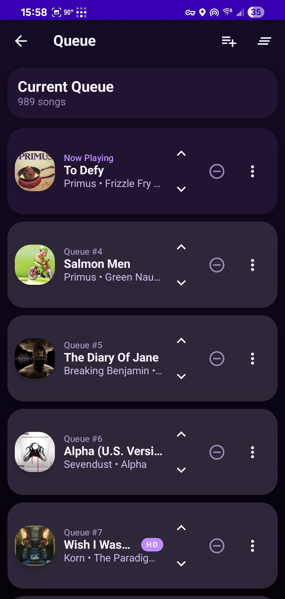
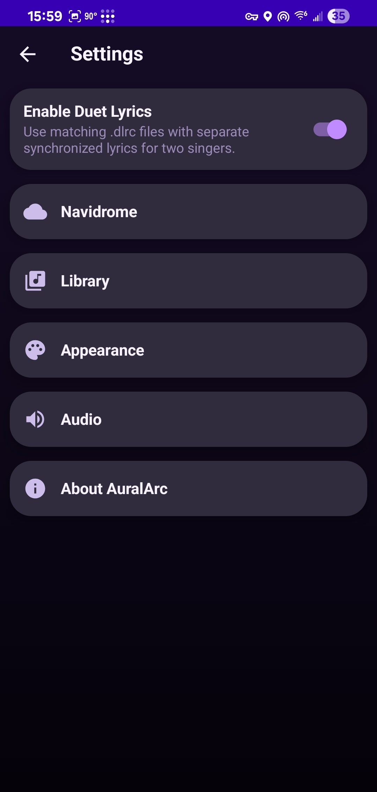
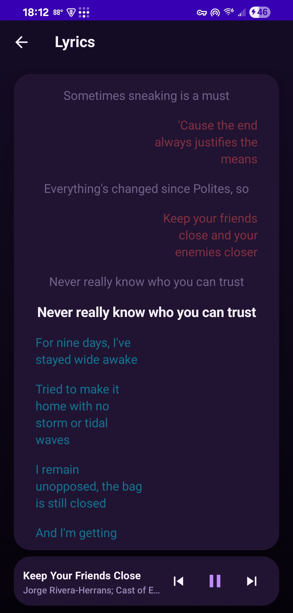

<p align="center">
  
</p>

<h1 align="center">AuralArc</h1>

<p align="center">
  <strong>A modern Android music player for local libraries and Navidrome.</strong><br />
  Built for flexible library management, rich metadata, smart playback, synced lyrics, and a polished listening experience.
</p>

<p align="center">
  
  
  
  
  
  
</p>

<p align="center">
  <strong>- - - Like my work? ❤️ - - -</strong><br />
  <strong><a href="https://ko-fi.com/therealkdude">Buy me a coffee on Ko-fi</a></strong><br />
</p>


> [!NOTE]
> AuralArc is under active development. Features, layouts, settings, and internal architecture may change as the project evolves.

---

## Screenshots

<table>
  <tr>
    <td align="center"><strong>Home</strong></td>
    <td align="center"><strong>Now Playing</strong></td>
    <td align="center"><strong>Lyrics</strong></td>
  </tr>
  <tr>
    <td></td>
    <td></td>
    <td></td>
  </tr>
  <tr>
    <td align="center"><strong>Library</strong></td>
    <td align="center"><strong>Queue</strong></td>
    <td align="center"><strong>Settings</strong></td>
  </tr>
  <tr>
    <td></td>
    <td></td>
    <td></td>
  </tr>
</table>

---

## About AuralArc

AuralArc is an Android music player designed around two kinds of libraries:

* **Local music** stored on the Android device or in folders selected through Android's Storage Access Framework.
* **Navidrome libraries** hosted on your own server.

The project combines a modern Jetpack Compose interface with AndroidX Media3 playback, detailed track metadata, flexible queue controls, listening statistics, synchronized lyrics, playlist artwork, and playback behavior that can be customized to suit different listening setups.

AuralArc is intended to feel equally at home as a straightforward offline music player and as a front end for a self-hosted music library.

> [!IMPORTANT]
> This app features a custom type of LRC file called a Duet LRC. It allows multiple singers to have their own lyrics in a column instead of everyone's lyrics being in a singular column. More information can be found on [the official repository page.](https://github.com/KeiranGamingTV/Duet-LRC-Lyric-File)

---

## Features

### Music library

* Browse music by **Songs**, **Albums**, **Artists**, and **Playlists**.
* Scan the Android media library through MediaStore.
* Add user-selected folders through the **Storage Access Framework (SAF)**.
* Switch between **Local** and **Navidrome** library sources.
* Cache library data to improve startup and browsing behavior.
* Sort tracks by:

    * Title
    * Artist
    * Album
    * Release date
* Optional compact song rows and album artwork in lists.
* **Today's Picks** section on the Home page.
* Recently listened and listening-history-aware features.

### Playback and queue management

* Playback powered by **AndroidX Media3 / ExoPlayer**.
* Background playback through a media foreground service.
* Android media notification / system media controls.
* Previous, Play/Pause, Next, Shuffle, and Repeat controls.
* **Add to Queue** and **Play Next** support.
* Reorder and manage the active queue without unnecessarily restarting playback.
* Repeat modes:

    * Off
    * Repeat All
    * Repeat One
* Playback state and queue synchronization between the app UI and Media3.
* Open supported audio files shared or launched from other Android apps.

### Smart Shuffle

AuralArc includes a configurable **Smart Shuffle** system with five levels:

| Level | Behavior                                           |
| ----- | -------------------------------------------------- |
| `0`   | Completely random                                  |
| `1`   | Mostly random with a small least-played boost      |
| `2`   | Balanced random / least-played behavior            |
| `3`   | Strongly favors less-played music                  |
| `4`   | Mostly least-played music with a little randomness |

Smart Shuffle uses listening statistics such as play count, completed plays, and listening time to influence ordering while preserving a random element.

### Lyrics

* Embedded lyrics extraction when supported by the source file.
* Sidecar **`.lrc` synchronized lyrics** support.
* Optional **`.dlrc` duet lyrics** with separate synchronized lines for two vocal parts.
* Lyrics can be shown directly from the Now Playing experience.
* Lyrics indexing and caching reduce repeated file lookups.

### Playlists

* Create and manage local playlists.
* Browse Navidrome playlists.
* Add tracks and albums to playlists where supported.
* **Automatic playlist artwork** generated from up to four distinct album covers.
* **Custom playlist artwork** selected by the user.
* Custom artwork is copied into app storage so it remains available after selection.

### Detailed audio and track information

AuralArc stores and displays a broad set of metadata when Android or the source library exposes it, including:

* Codec
* MIME type
* Bitrate
* Sample rate
* Bit depth
* Channel count
* File size
* Container / extension
* Source type and path
* Release date and year
* Disc and track number
* ReplayGain track / album gain
* ReplayGain peak values
* Extractor and audio-track information
* Encoder delay / padding
* Additional scanner diagnostics

Tracks reporting **24-bit or higher** bit depth can display an **HD badge**.

> [!IMPORTANT]
> Android does not expose every part of the final audio output path to normal apps. AuralArc can report track and decoder metadata, but values such as the true hardware DAC path, final Android mixer format, Bluetooth codec state, or guaranteed bit-perfect output may require device-specific verification outside the app.

### Audio behavior

* Android audio-focus handling.
* Configurable resume behavior after focus changes or calls.
* Optional volume ducking for temporary interruptions.
* Pause on permanent audio-focus loss.
* Optional pause when headphones, AUX, or Bluetooth audio disconnects.
* Configurable behavior when AuralArc is completely closed.
* Device-backed equalizer support with stored multi-band preferences.
* Stored advanced-audio preferences for ReplayGain, resampling, dithering, and DVC-style behavior as those systems continue to evolve.

### Navidrome integration

* Connect to a self-hosted **Navidrome** server.
* Save server credentials locally.
* Browse a remote library inside AuralArc.
* Load remote artwork and audio.
* Browse Navidrome playlists.
* Built-in **Navidrome Diagnostics** screen for connection troubleshooting.
* Clear saved server settings from the app.

### Duet LRC (.dlrc) In Action



---

## Tech Stack

| Component             | Current project configuration             |
| --------------------- | ----------------------------------------- |
| Language              | Kotlin `1.9.24`                           |
| UI                    | Jetpack Compose                           |
| Compose BOM           | `2024.06.00`                              |
| Playback              | AndroidX Media3 / ExoPlayer `1.10.1`      |
| Navigation            | Navigation Compose `2.7.7`                |
| Metadata              | Android media APIs + `jaudiotagger 2.2.3` |
| Android Gradle Plugin | `8.9.1`                                   |
| Gradle                | `8.11.1`                                  |
| Java / JVM            | Java 17                                   |
| Minimum SDK           | API 29 — Android 10                       |
| Target SDK            | API 34                                    |
| Compile SDK           | API 36                                    |

---

## Getting Started

### Prerequisites

Before building AuralArc, install:

* A recent version of **Android Studio** compatible with AGP 8.9.x.
* **JDK 17**.
* Android SDK Platform **36**.
* An Android device or emulator running **API 29 / Android 10 or newer**.

### Clone the repository

```bash
git clone https://github.com/KeiranGamingTV/AuralArc.git
cd AuralArc
```

### Open and build

1. Open the project in Android Studio.
2. Allow Gradle to sync and download dependencies.
3. Confirm Android Studio is using **JDK 17** for Gradle.
4. Install any missing SDK components when prompted.
5. Connect an Android device or start an emulator.
6. Run the `app` configuration.

You can also build a debug APK from the command line:

```bash
./gradlew assembleDebug
```

On Windows Command Prompt or PowerShell:

```powershell
.\gradlew.bat assembleDebug
```

The resulting APK will normally be placed under:

```text
app/build/outputs/apk/debug/
```

---

## Local Library Setup

AuralArc can read music from Android's media library and from explicitly selected folders.

### Media library access

On modern Android versions, grant AuralArc permission to access audio when prompted.

### Custom folders

Use:

```text
Settings → Library → Folder Picker
```

to select additional folders through Android's Storage Access Framework.

Using SAF allows AuralArc to work with user-approved locations without requiring unrestricted filesystem access.

---

## Navidrome Setup

To connect a Navidrome server:

1. Make sure your Navidrome instance is reachable from the Android device.
2. Open AuralArc.
3. Go to:

```text
Settings → Navidrome → Server Settings
```

4. Enter your server information and credentials.
5. Save the configuration.
6. Switch the library source to **Navidrome**.

If the library does not load correctly, use:

```text
Settings → Navidrome → Diagnostics
```

for connection troubleshooting.

> [!TIP]
> If you are using a Navidrome server on your home network, confirm that your phone can reach the server address directly and that local firewall rules permit the connection.

---

## Lyrics File Support

For sidecar synchronized lyrics, place an `.lrc` file where AuralArc can locate it and use a matching track name / metadata convention.

Example:

```text
Music/
├── Song Name.flac
└── Song Name.lrc
```

For duet lyrics, AuralArc can optionally use matching `.dlrc` files when **Enable Duet Lyrics** is turned on in Settings.

```text
Music/
├── Duet Song.flac
└── Duet Song.dlrc
```

---

## Project Structure

The main source lives under:

```text
app/src/main/java/com/example/auralarc/
```

A simplified overview:

```text
com.keiranhaas.auralarc/
├── data/          # Track, playlist, library-source, and identity models
├── navidrome/     # Navidrome API, authentication, library, and playlist logic
├── navigation/    # Compose navigation routes
├── player/        # Media3 playback, queue, shuffle, repeat, EQ, notification state
├── scanner/       # MediaStore and SAF music scanning
├── storage/       # Preferences, playlists, lyrics, artwork, cache, stats, tag editing
├── ui/
│   ├── components/
│   ├── library/
│   ├── nowplaying/
│   ├── playlists/
│   ├── queue/
│   ├── settings/
│   ├── stats/
│   ├── theme/
│   └── trackinfo/
└── utils/         # Artwork, metadata, quality, duration, and intent helpers
```

---

## Android Permissions

AuralArc currently declares permissions for the functionality below:

| Permission / capability   | Why it is used                                                  |
| ------------------------- | --------------------------------------------------------------- |
| Audio/media access        | Scan and play local music                                       |
| Foreground media playback | Continue playback while the app is not in the foreground        |
| Notifications             | Display playback controls on supported Android versions         |
| Internet                  | Connect to Navidrome servers and load remote media/artwork      |
| Network state             | Assist with network-aware remote-library behavior               |
| Modify audio settings     | Support audio-processing functionality where Android permits it |

Exact permission behavior varies by Android version.

---

## Development Status

AuralArc is currently an **active development project** rather than a finished, stability-guaranteed release.

Areas being actively refined include:

* Playback and queue edge cases
* Media notification behavior across Android vendors
* Library scanning and metadata accuracy
* Navidrome integration
* Playlist behavior and artwork
* Lyrics matching and presentation
* Advanced audio processing
* UI polish and animation
* Performance with large libraries

If you are testing the app, bug reports that include the Android version, device model, library source, affected audio format, and reproduction steps are especially useful.

---

## Contributing

Contributions, testing, and bug reports are absolutely welcome!

A typical contribution workflow:

1. Fork the repository.
2. Create a feature or fix branch.
3. Make and test your changes.
4. Keep commits focused and descriptive.
5. Open a pull request describing what changed and how it was tested.

For larger changes, consider opening an issue first so the implementation can be discussed before significant work is done.

---

## Bug Reports

When reporting a bug, include as much of the following as possible:

* AuralArc version / commit
* Android version
* Device model
* Local or Navidrome library
* Audio format involved, if relevant
* Exact reproduction steps
* Expected behavior
* Actual behavior
* Screenshots or a screen recording
* Relevant Logcat output, if available

---

## Acknowledgements

AuralArc is built with and benefits from projects and technologies including:

* [Android](https://developer.android.com/)
* [Kotlin](https://kotlinlang.org/)
* [Jetpack Compose](https://developer.android.com/compose)
* [AndroidX Media3](https://developer.android.com/media/media3)
* [Navidrome](https://www.navidrome.org/)
* [jaudiotagger](https://github.com/ijabz/jaudiotagger)

---

<p align="center">
  <strong>AuralArc</strong><br />
  Your library. Your server. Your listening experience.
</p>
